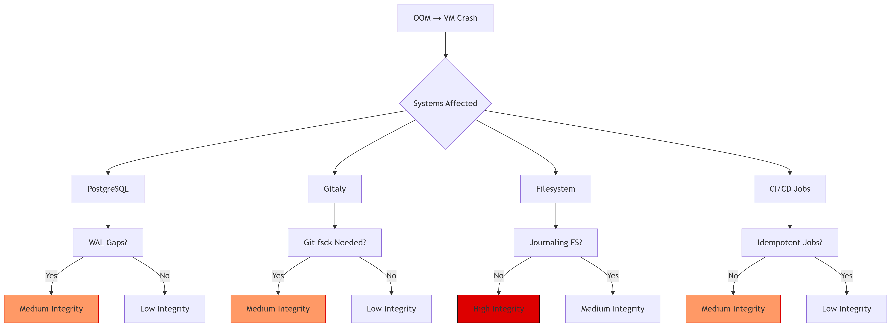
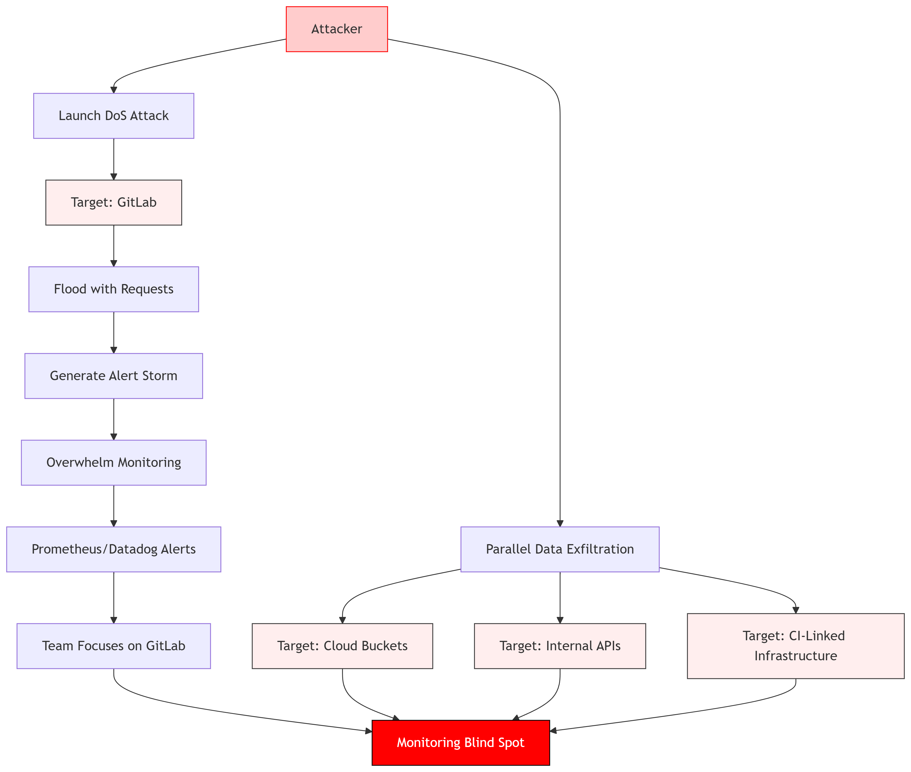
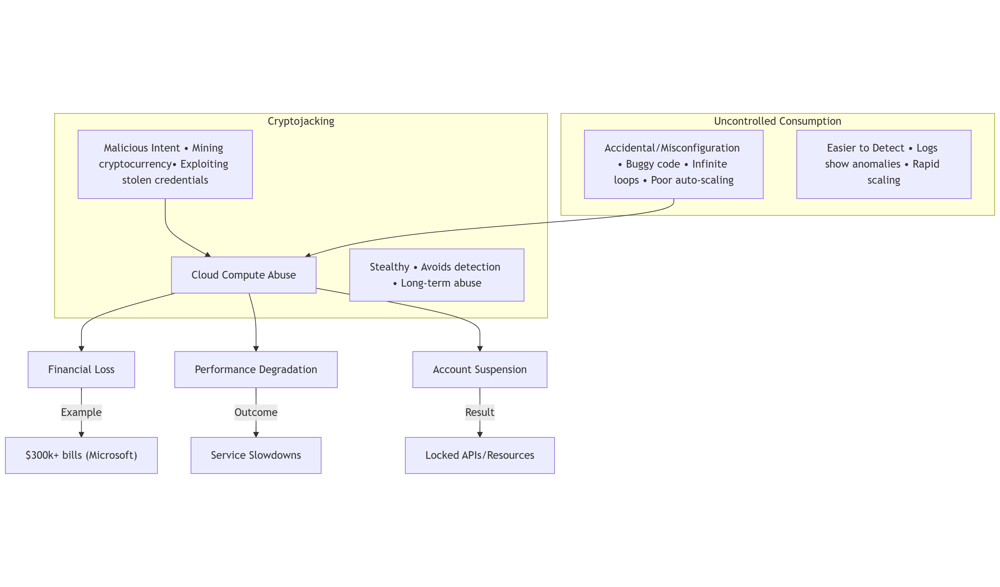

# Unauthenticated Gitlab DoS

Uncontrolled Resource Consumption - 8vCPU &amp; 16GB RAM GCP Instance OOM Crash.

Gitlab doesn't accept 99.9% of DoS vulnerabilities. This vulnerability is out-of-scope unfortunately 😔.

`DoS vulnerabilities caused by unlimited input fields`

Out-of-scope bugs are useless noise (🗑️) — they waste time chasing irrelevant issues that don’t impact the actual target, like reporting a typo in a login page’s footer. They distract from real threats, clog reports with garbage, and show you didn’t bother reading the rules.

Submitting them is like demanding a refund for a sandwich you didn’t order.

## Video POC

[](https://youtu.be/14dYnut-bAs)

## Quick Start

1. Clone the repository:
```
git clone https://github.com/justas-b1/Gitlab-DoS2.git
cd Gitlab-DoS2
```

2. Run
```
python poc.py --domain https://your-gitlab-domain.com
```

## 🔧 Command-Line Options

| Argument        | Description                                                 | Default |
| --------------- | ----------------------------------------------------------- | ------- |
| `--domain`      | **(Required)** GitLab base URL (e.g., `https://your-gitlab-domain.com`) | *None*  |
| `--threads`     | Number of concurrent threads                                | `99`     |
| `--delay`       | Delay (in seconds) between launching threads                | `1.0`   |
| `--batch-delay` | Delay (in seconds) between batches                          | `7.0`   |
| `--batch-size`  | Number of threads per batch before applying batch delay     | `7`     |

## 🧪 Requirements

| Requirement      | Description                                              |
| ---------------- | -------------------------------------------------------- |
| Python 3.6+      | Standard Python interpreter                              |
| curl             | Must be available in system PATH (e.g. `curl --version`) |
| OS Compatibility | Works on Windows, Linux, and macOS                       |

## 🧠 What the Script Does

| Component                     | Purpose                                                      |
| ----------------------------- | ------------------------------------------------------------ |
| `argparse`                    | Parses CLI arguments                                         |
| `GRAPHQL_ENDPOINT`            | Constructs GitLab `/api/graphql` endpoint from base domain   |
| `variables`                   | Defines GraphQL input, including huge `types` array          |
| `tempfile.NamedTemporaryFile` | Writes JSON payload to disk to bypass Windows CLI limits     |
| `subprocess.run`              | Calls `curl -d@file.json ...` to post request using the file |
| `threading.Thread`            | Manages parallel requests in Python threads                  |
| `os.remove()`                 | Deletes the temporary file after all threads finish          |

## 🔍 Explanation
The GitLab /api/graphql endpoint doesn't enforce strict input size limits, allowing it to accept very large payloads. While this flexibility is useful, it can lead to issues when the payload grows significantly in size.

Internally, the GraphQL API performs several resource-intensive operations, such as querying for large datasets or resolving complex queries. These operations are generally manageable if the input payload is small, typically under 1KB. However, when the input grows to several megabytes, it places considerable strain on the backend. This can result in slower response times, higher memory usage, and in extreme cases, timeouts or failures.

By testing with large payloads, we can identify the system's ability to handle heavy loads and determine potential performance bottlenecks. This helps in understanding the limitations of the API when dealing with high-volume queries and large datasets, especially in production environments.

## Impact

Auto-scaling under attack can cause a cost spike, potentially breaching budget thresholds or credit limits.

If there's no auto-scaling and instance is default, recommended 8vCPU and 16GB ram:

In Linux, an OOM (Out-of-Memory) crash is technically referred to as an "OOM Killer event" or "OOM-induced system termination." In POC video, it crashes in the last 20 seconds.


**Attack Vector (AV:N)** - Attacker can exploit this remotely.

**Attack Complexity (AC:L)** - Attack uses a very simple python script.

**Privileges Required (PR:N)** - The endpoint is unauthenticated.

**User Interaction (UI:N)** - There's no user interaction required.

**Scope (S:C)** - Changed. Affects VM, which is above Gitlab application and also affects cloud hosting account if auto-scaling is enabled.

**Integrity Impact (I:N)** - None. Might be low if temporary data is lost during VM crash.



**Availability Impact (A:H)** - High. Instance crashes completely, unavailable for all users.

From https://gitlab-com.gitlab.io/gl-security/product-security/appsec/cvss-calculator/

`When evaluating Availability impacts for DoS that require sustained traffic, use the 1k Reference Architecture. The number of requests must be fewer than the "test request per seconds rates" and cause 10+ seconds of user-perceivable unavailability to rate the impact as A:H.`

This attack used < 1RPS which eventually caused an OOM crash on 1k Reference Architecture instance.

### Theoretical Impact

1. Advanced Monitoring Blind Spots: Alert Overload as a Smokescreen for Data Exfiltration

DoS attacks are very noisy by nature—crashing services, flooding logs, and triggering alert storms. But that chaos can work in the attacker's favor. By overwhelming observability tools like Prometheus or Datadog with garbage metrics and cardinality explosions, an attacker can distract responders and degrade monitoring fidelity.

A DoS on GitLab instance, for example, might not be the end goal—just the distraction. While teams scramble to stabilize GitLab, the attacker quietly hits a more valuable target elsewhere: cloud buckets, internal APIs, or CI-linked infrastructure.



2. Cloud Provider Blacklisting/Suspension

The attack causes 100%+ CPU usage over extended period of time.
Providers like DigitalOcean, AWS, etc. use heuristic models to flag "suspicious" resource consumption. Legitimate causes (e.g., DDoS attacks, unoptimized code, or intensive computations) might be **mislabeled as abusive**, leading to temporary account suspension.

Cryptojacking and Uncontrolled Resource Consumption are very similar in a way that they both use up computational resources and can result in massive financial damages, budget limit based account locks or even suspensions.



## 💡 Company Information

GitLab is a web-based DevOps platform that provides an integrated CI/CD pipeline, enabling developers to plan, develop, test, and deploy code seamlessly. Key features include:

- Version Control (Git)
- Issue Tracking 🐛
- Code Review 🔍
- CI/CD Automation 🚀

## 🏢 Who Uses GitLab?

GitLab is trusted by companies of all sizes, from startups to enterprises, including:

| Company       | Industry              |
| ------------- | --------------------- |
| Goldman Sachs | Finance 💵            |
| Siemens       | Engineering ⚙️        |
| NVIDIA        | Technology 💻         |
| T-Mobile      | Telecommunications 📱 |
| NASA          | Aerospace 🚀          |

## 🛡️ GitLab in Defense

GitLab is favored by U.S. Department of Defense (DoD) agencies for secure, self-hosted DevSecOps environments, offering:

- On-Premise Deployment 🖥️
- Security & Compliance 🔒

Its ability to manage sensitive data and maintain operational control makes GitLab a key tool for government and defense sectors.

## Affected Websites

Shodan query: http.title:"GitLab"

Returns more than 50 thousand results.


## ⚠️ Legal Disclaimer  
This Proof-of-Concept (PoC) is provided **for educational purposes only**.  

- **Authorized Use Only**: Test only on systems you own or have explicit permission to assess.  
- **No Liability**: The author is not responsible for misuse or damages caused by this tool.  
- **Ethical Responsibility**: Do not use this tool to violate laws or exploit systems without consent.  

By using this software, you agree to these terms. 
